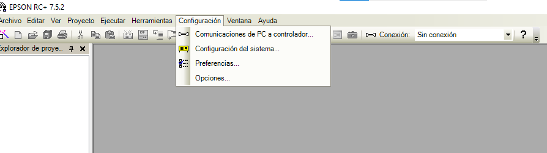

# Lab_Epson
Repositorio para Laboratorio realizado con Robot EPSON
Integrantes:

***Eduardo Cuadros Montealegre***

***Oscar Javier Restrepo***


## Introducción
La empresa Control de Movimiento ofreció una capacitación para los estudiantes del curso de Robótica de la Universidad Nacional de Colombia, Sede Bogotá. En ella se utilizó un robot SCARA de la marca EPSON, del modelo T6. Previo a la visita a sus instalaciones se desarrolló en el software EPSON RC, funciones de movimiento llevadas a aplicaciones prácticas de paletizado, para luego aplicarlas a la versión real del robot.

A lo largo del presente documento se muestran los pasos que se deben seguir desde el software para el desarrollo de los procedimientos y la simulación empleando el software EPSON RC. De igual manera se detalla el código ejecutado junto con los videos que muestran al robot SCARA T3 ejecutando las acciones programadas
## Objetivos
Conexión al software EPSON RC + 7.0.

Afianzar manejo del Robot Manager.

Consolidar el uso de los comandos Go, Move, Jump, Pallet y Pallet Outside, en el simulador y con el Robot.
## Desarrollo
Luego de ejecutar el software EPSON RC, se debe hacer clic en Proyecto/Cerra. De esta manera se garantiza que no se tiene ningún proyecto abierto.

Posteriormente se establece la comunicación del PC al controlador para ello se hace clic en Comunicaciones de PC a controlador



Se selecciona el controlador y se hace clic en conectar


Ahora aparece en la parte de Conexión el nombre del controlador seleccionado. En este paso, el software se demora algo mientras reinicia el controlador


Se hace clic en Configuración/Configuración del sistema y se verifica que en Robots aparezca el robot seleccionado SCARA T6-602 y luego se hace clik en cerrar.


Posteriormente se hace clic en Simulator y nos aparece el robot en una zona de trabajo.


Abrimos el proyecto con el código del programa SPEL, el cual es el lenguaje de programación para los robot EPSON.


Nos Aparece el código desarrollado para la función main y cada una de las funciones creadas, en este caso varias de paletizado.


En las siguientes líneas aparece en código empleado
```
Function main

  Motor On
  Power High
  Pallet 1, Origen, Ejey, Ejex, 2, 3
  Pallet Outside, 2, Origen, Ejey, Ejex, 2, 3
  Accel 30, 30
  Speed 50
  
  Jump Origen
  Wait 0.5
  Go Ejex
  Wait 0.5
  Go Ejey
  Wait 0.5
  Do
  	If MemSw(512) Then
  		Call paletizado_z
  	EndIf
  	If MemSw(513) Then
  		Call paletizado_s
  	EndIf
  	If MemSw(514) Then
  		Call paletizado_externo
  	EndIf
  Loop
Fend
Function paletizado_z
	#define estado_paletizado_z 11 'Entrada digital
	On estado_paletizado_z
	Integer i
	For i = 1 To 6
		Jump Pallet(1, i)
	Next
	Off estado_paletizado_z
Fend
Function paletizado_s
	#define estado_paletizado_s 10 'Entrada digital
	On estado_paletizado_s
	Integer i	
	For i = 1 To 2
		Jump Pallet(1, i)
	Next
	For i = 4 To 3 Step -1
		Jump Pallet(1, i)
	Next
	For i = 5 To 6
		Jump Pallet(1, i)
	Next
	Off estado_paletizado_s
Fend
Function paletizado_externo
	Integer i, j
	#define estado_paletizado_externo 13 'Entrada digital
	On estado_paletizado_externo
	For i = 1 To 3
		For j = 1 To 4
			Jump Pallet(2, i, j)
		Next
	Next
	Off estado_paletizado_externo
Fend
```

Ahora se compila el código


Se valida que se haya compilado sin errores. Esos se puede apreciar en la ventana inferior del programa


Se hace clic en el ícono de ejecutar y se despliega una ventana emergente en la cual podemos seleccionar la función a ejecutar. 


Cuando se hace clic en iniciar aparece un cuadro que dice está listo para comenzar?


Al hacer clic en Si se puede apreciar la simulación del robot ejecutando cada una de las acciones programadas.


## Videos
Primeros movimientos del Robot Scara T6
[](https://youtube.com/shorts/D-2qUfs76IA)
Movimientos para paletizado  del Scara T6
[](https://youtube.com/shorts/M-C3dDOEr-M)


